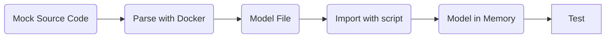

You have to test your code!

I mean, *really*.

But sometimes, testing is hard, because you do not know how to start (often because it was hard to start with TDD or better XtremTDD :smile:).

One challenging situation is the creation of mock to *represent* real case and use them as test ressources.
This situation is common when dealing with code modelisation and meta-modelisation.

Writting manually a model to test feature on it is hard.
Today, I'll present you how to use GitHub Actions as well as GitLab CI to create tests for the Moose platform based on real ressources.

---

First of all, let's describe a simple process when working on modelisation and meta-modelisation.


flowchart LR
    SourceCode(Source Code) --> Parse --> modelfile(Model File) --> Import --> model(Model in Memory) --> Use


When performing a software system analysis using MDE, everything starts with parsing the source code of the application to produce a model.
This model can then be stored in a file.
Then, we import the file in our analysis environment, and we use the concrete model.

All these steps are the one performed before using a model.
*However*, when we create tests for the `Use` step, we do not perform all the steps before.
We create a mock model.
Even if this situation is confortable, it is error-prone and makes easy unsynchronisation between tools to manipulate a model, and tools that create a model.

One solution is thus not to create mock model, but to create mock source code files.

## Proposed approach

Using mock source code file, we can reproduce the all process for each test (or better, group of tests :wink:)



In the following, I describe the implementation/set-up of the approach for Pharo and Moose.
It consists of the following steps:

- Create mock ressources
- Create a bridge from your Pharo image to your ressources using PharoBridge
- Create a GitLab Ci or a GitHub Action
- Test :heart:

## Create mock ressources

The first step is to create mock ressources.
To do so, the easiest way is to include them in your git repository.

You should have:

```raw
> ci // Code executed by the CI
> src // Source code files
> tests // Tests ressources
```

Inside the `tests` folder, it is possible to add several sub-folders for different tests ressources.

## Create a Pharo Bridge

To easily use the folder of the test ressource repository from Pharo, we will use the Pharo Bridge project.

The project can be added to your Pharo Baseline with the following piece of code:

```st
spec
    baseline: 'GitBridge'
    with: [ spec repository: 'github://jecisc/GitBridge:v1.x.x/src' ].
```

Then, to connect our Pharo project to the test-resources, we create a class in one of our package, subclass of `GitBridge`.

A full example would be:

```st
Class {
    #name : #MyBridge,
    #superclass : #GitBridge,
    #category : #'MyPackage-Bridge'
}

{ #category : #initialization }
MyBridge class >> initialize [

    SessionManager default registerSystemClassNamed: self name
]

{ #category : #'accessing' }
MyBridge class >> testsRessources [
    ^ self root / 'tests'
]
```

The method `testsRessources` can then be use to access the local folder with the tests ressources.

**Be carreful**, this set-up only works in local for now.
To use it with GitHub and GitLab, we first have to setup our CI files.

## SetUp CI files

To setup our CI files, we first create in the `ci` folder of our repository a `preloading.st` file that will execute Pharo code.

```st
(IceRepositoryCreator new
    location: '.' asFileReference;
    subdirectory: 'src';
    createRepository) register
```

This code will be run by the CI and register the Pharo project inside the Iceberg tool of Pharo.
This registration is then used by GitBridge to retrieve the location of the tests ressources folder.

Then, we have to update the `.smalltalk.ston` file (used by every smalltalk ci process) and adds a reference to our `preloading.st` file

```st
SmalltalkCISpec {
  #preLoading : 'ci/preLoading.st',
    ...
}
```

### SetUp GitLab CI

The last step for GitLab is the creation of the `.gitlab-ci.yml`.

This CI can includes several steps.
We now present the steps dedicated to testing Java model, but the same steps applied for other programming language.

First, we have to parse the tests-ressources using the [docker version of VerveineJ]()

```yml
stages:
  - parse
  - tests

parse:
  stage: parse
  image:     
    name: badetitou/verveinej:v3.0.0
    entrypoint: [""]
  needs:
    - job: install
      artifacts: true
  script:
    - /VerveineJ-3.0.0/verveinej.sh -Xmx8g -Xms8g -- -format json -o output.json -alllocals -anchor assoc -autocp ./tests/lib ./tests/src 
  artifacts:
    paths:
      - output.json
```

The `parse` stage usees the `v3` of VerveineJ, parses the code, produces a `output.json` file including the produced model.

Then, we add the common `tests` stage of smalltalk ci.

```yml
tests:
  stage: tests
  image: hpiswa/smalltalkci
  needs:
    - job: parse
      artifacts: true
  script:
    - smalltalkci -s "Moose64-10"
```

This stage creates a new `Moose64-10` image and performs the CI based on the `.smalltalk.ston` configuration file.

### Setup GitHub CI

## Test
