## Introduction

Casino aims to migrate semi-automatically the front-end of applications regardless of its implementing language.
The front-end corresponds to the widgets, and their behaviors.

## Migration Strategy

Here is a diagram showing the migration steps implemented by Casino.

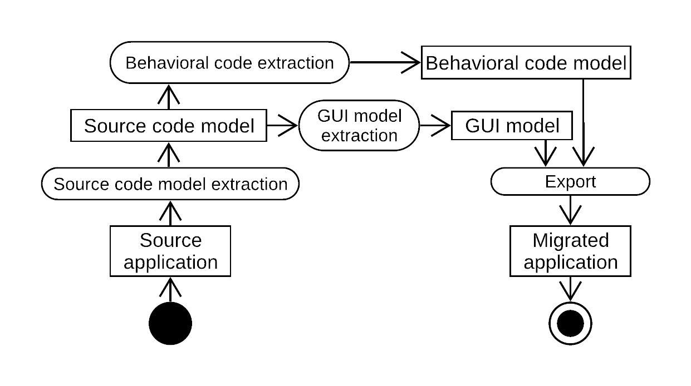

## GUI Meta-model

### Full Widgets meta-model

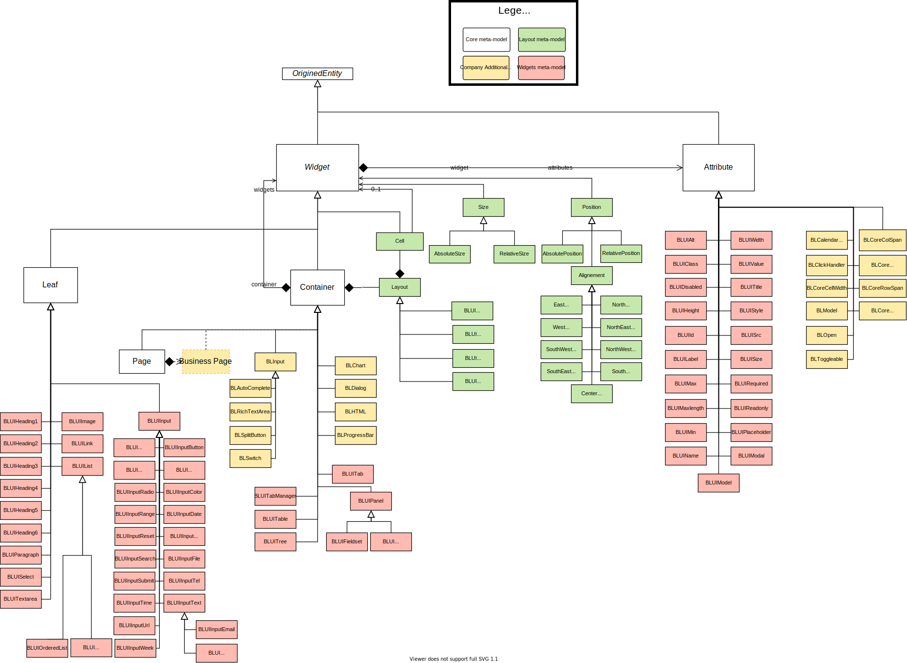

[Download the metamodel](img/Metamodels-Widgets-full.svg)

## Current results

Here are some examples of the results obtained for GWT application migration to Angular:

|        Source Application (GWT)         |          Target Application (Angular)           |
| :-------------------------------------: | :---------------------------------------------: |
|    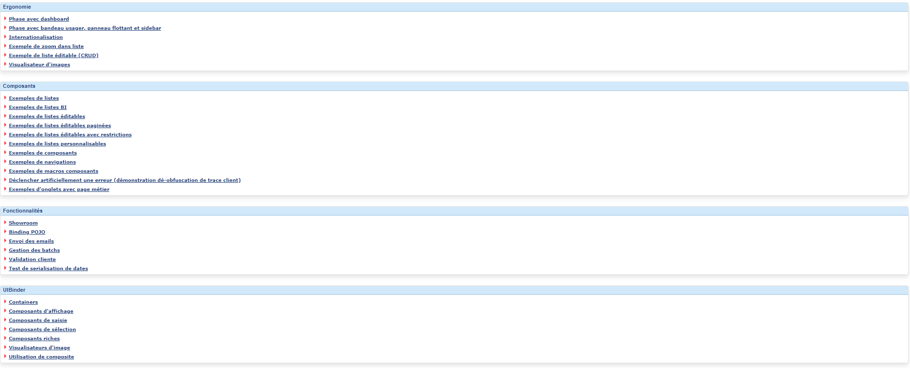    |    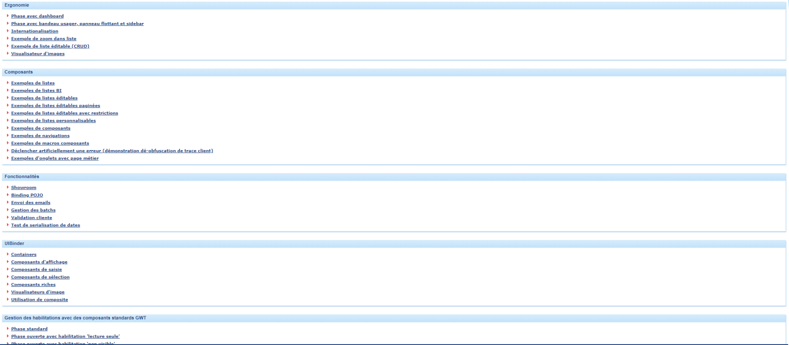    |
| 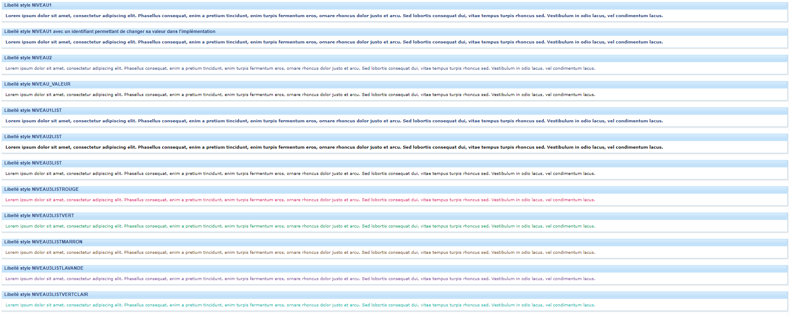 | 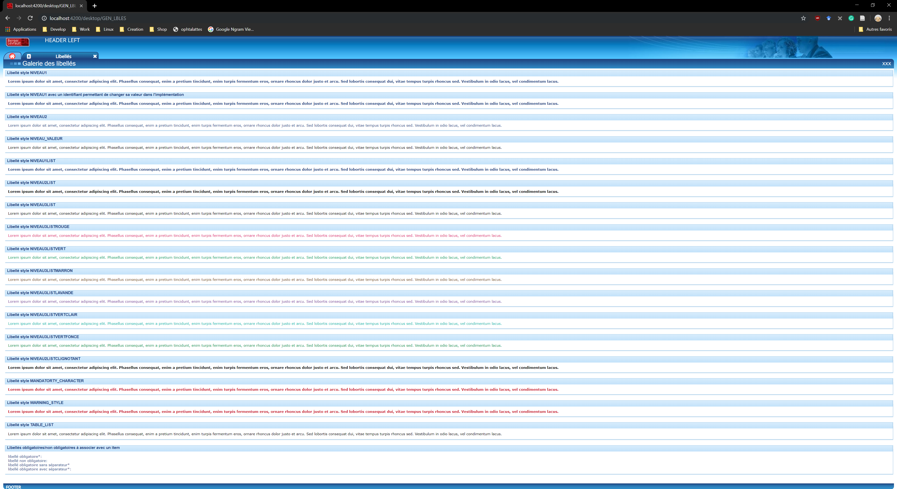 |
|     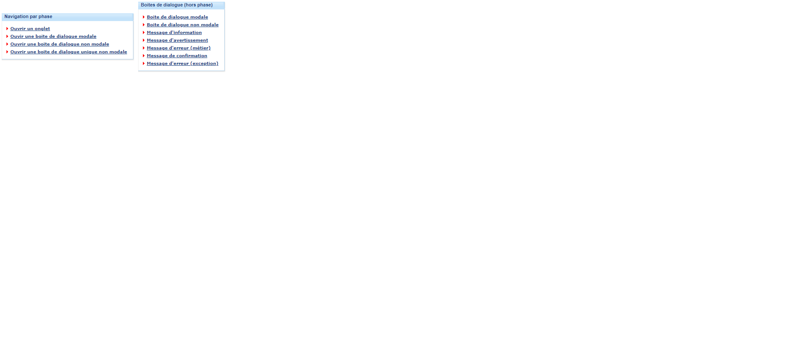     |     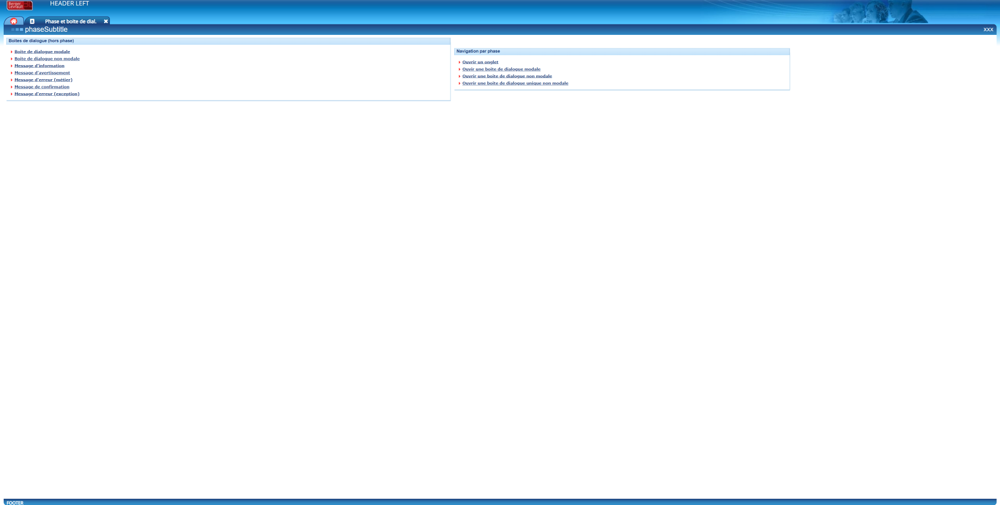     |
|    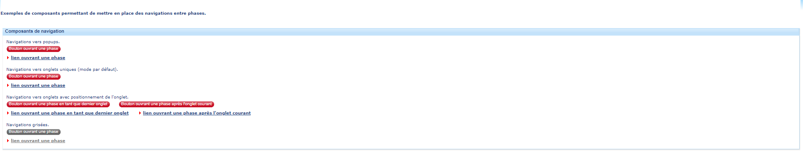    |    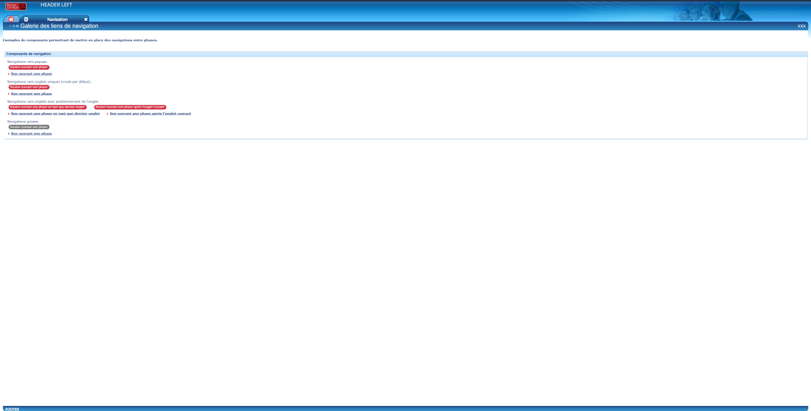    |
|  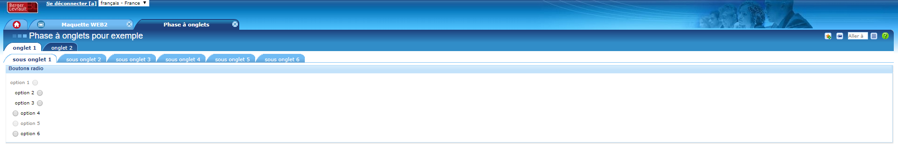  |  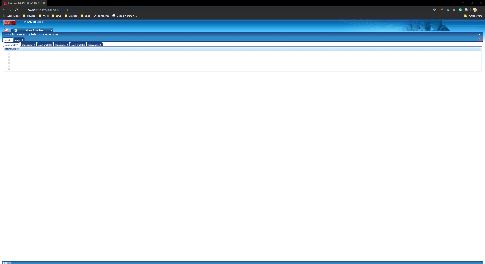  |
|  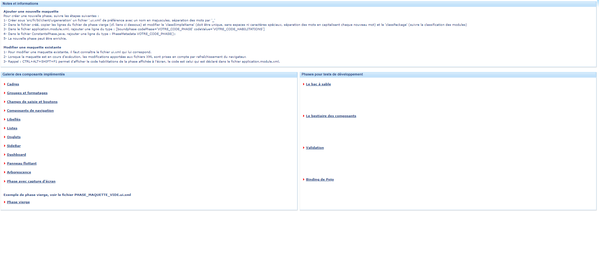  |  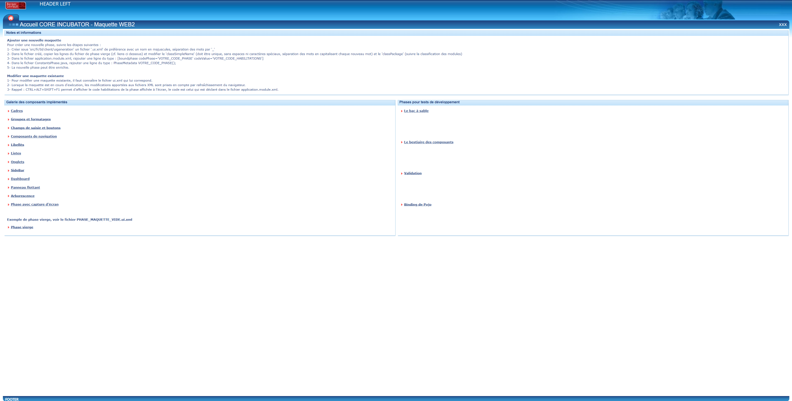  |

Here are some other examples of the results obtained for GWT application migration to Seaside ([Traccar](https://www.traccar.org/)):

|              Source Application (GXT)               |                Target Application (Seaside)                 |
| :-------------------------------------------------: | :---------------------------------------------------------: |
|     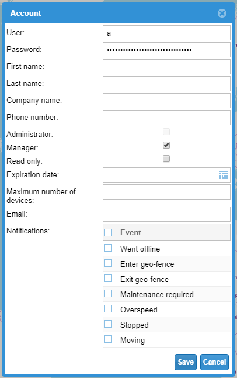     |     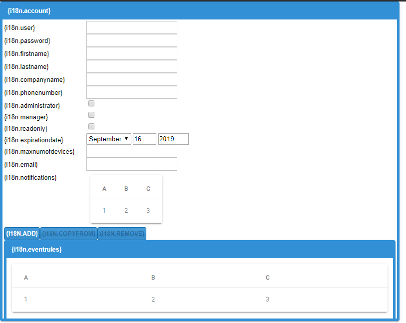     |
|       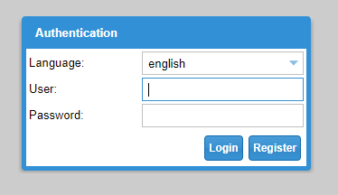       |       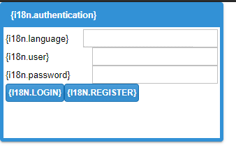       |
| 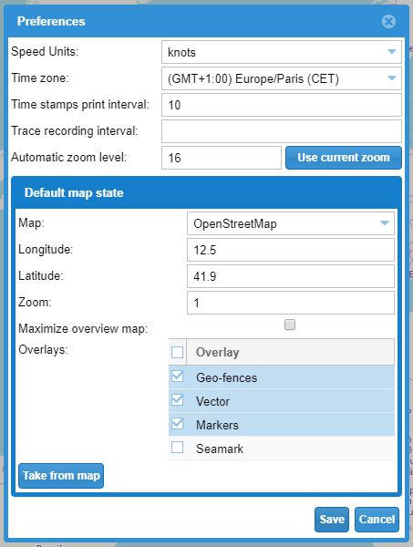 | 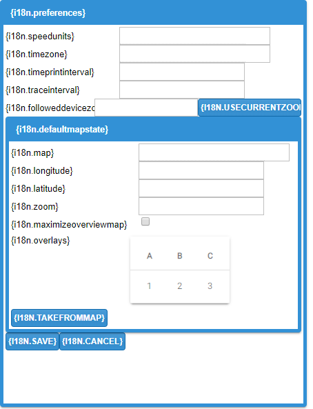 |

## Links

The core of the project (with the importer GWT and the exporter Angular) is available on [github](https://github.com/badetitou/Casino).
There are also:

|                                Importer                                 |                            Exporter                             |
| :---------------------------------------------------------------------: | :-------------------------------------------------------------: |
|       [Swing](https://github.com/badetitou/Casino-Swing-Importer)       |    [Spec](https://github.com/badetitou/Casino-Spec-Exporter)    |
|        [Spec](https://github.com/badetitou/Casino-Spec-Importer)        |   [Spec2](https://github.com/badetitou/Casino-Spec2-Exporter)   |
|        [HTML](https://github.com/badetitou/Casino-HTML-Importer)        | [Seaside](https://github.com/badetitou/Casino-Seaside-Exporter) |
|       [GWT/GXT](https://github.com/badetitou/Casino-GWT-Importer)       | [Aurelia](https://github.com/badetitou/Casino-Aurelia-Exporter) |
| [Silverlight](https://github.com/badetitou/Casino-Silverlight-Importer) |                                                                 |

Some importers or exporters are still in beta version.
However, you can help us! :smile:

To use Casino, we must use a [Moose 8 image](https://moosetechnology.github.io/moose-wiki/Beginners/InstallMoose.html).

## Contact

[contact me](mailto:badetitou@gmail.com)
